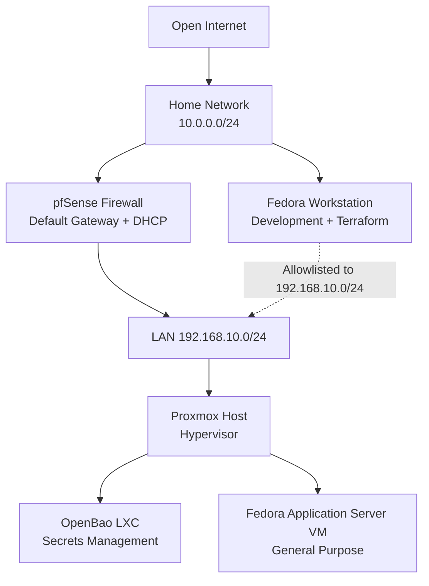
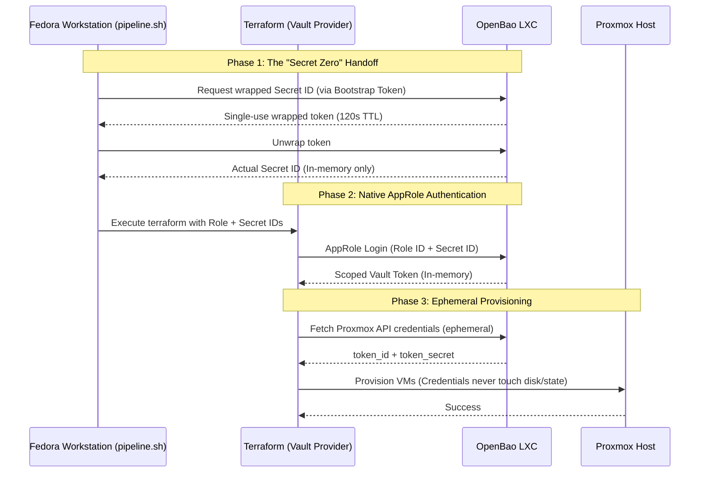

# Homelab Infrastructure as Code

Learning infrastructure automation through a self-hosted homelab — provisioning Proxmox virtual machines with Terraform, using OpenBao for secrets management, and building toward a fully automated pipeline.

---

## Architecture


### Network Topology




### IaC OpenBao Auth Workflow


---

## Stack

- **Proxmox**   — I chose Proxmox as my hypervisor to run on my homelab hardware. 
- **OpenBao**   — I realized if I was going to use Terraform to provision infrastructure in Proxmox, I should setup proper secrets management and learn. I picked OpenBao instead of Vault because of the BSL license change, still navigating which HashiCorp tools I should use vs their open sourced forks. This is running on an LXC container I setup within Proxmox.
- **Terraform** —  My tool for Infrastructure provisioning. The goal is to define everything as code going forward so the homelab is reproducible and version controlled especially when setting things up for my coursework.
    - **bpg/proxmox** provider     — I found it was more complete than Telmate.
    - **hashicorp/vault** provider — fully compatible with OpenBao.
- **Ansible** — I'm experimenting with Ansible as configuration management for infrastructure I provision. Terraform creates the container, Ansible configures it. 

---

## What I Built and Why

### Starting Point


I wanted to provision VMs on Proxmox for coursework in an easily documented, and defined way. I've used Terraform with cloud providers before, but decided to integrate it into my Proxmox workflows. This also allows me to practice provisioning via IaC more. As I was initially exporting variables, I was thinking of how to handle things like the Proxmox API token securely. Hardcoding credentials or storing them in `.tfstate` is a bad idea, so I built a proper secrets management layer to integrate in with Terraform.

### Secrets Management

I deployed OpenBao as an LXC container on Proxmox and stored the Proxmox API token in a KV v2 secrets engine. I didn't initially realize the Terraform Vault provider deprecated `vault_kv_secret_v2` as a data source in favor of an ephemeral resource. So I swapped that since it means the credentials aren't written to state ever.

### AppRole Authentication

I did some research by reading HashiCorp's articles on AppRole authentication and decided to implement it, rather than authenticating Terraform to OpenBao with a static token. The AppRole is bound to a policy that only permits reading `proxmox/data/terraform`. Nothing else in OpenBao is accessible to Terraform so, even if the credentials were compromised, the "blast radius" is limited to that single secret path.

### Wrapped Secret IDs

The remaining problem was how to handle the AppRole Secret ID itself. Exporting this secret as a variable was the exact scenario I was trying to avoid. The article I read suggested using OpenBao's response wrapping. A bootstrap token (scoped only to generate Secret IDs) requests a wrapped, single-use token at runtime. That token is unwrapped in memory by `pipeline.sh` and passed to Terraform via environment variables

### No Hardcoded Values

All infrastructure-specific values (Bao address, Proxmox endpoint, bootstrap token, Role ID) live in a gitignored `.env` file and are injected via `TF_VAR_*` environment variables. Nothing sensitive is committed to any repository.

### Ansible

Instead of using Terraform provisioners or shell scripts for configuration, I have been experimenting with Ansible as the configuration management layer. Ansible is agentless (it connects over SSH using the same keys injected at creation) so it doesn't install anything. 

---

## What Was Required to Set This Up

- Proxmox host with an API token created for Terraform
- OpenBao server running and unsealed, with the Proxmox token stored at `proxmox/data/terraform` (KV v2)
- AppRole auth enabled in OpenBao with a scoped policy and a separate bootstrap token policy
- A `.env` file (gitignored) containing `VAULT_ADDR`, `VAULT_SKIP_VERIFY`, `VAULT_BOOTSTRAP_TOKEN`, `VAULT_ROLE_ID`, `TF_VAR_proxmox_endpoint`, and `SSH_PUBLIC_KEY_PATh`
- Terraform >= 1.10 for ephemeral resource support
- `jq` for parsing wrapped token responses in `pipeline.sh`
- Ansible installed on the Workstation

---

## Project Structure

```
.
├── terraform/
│   └── proxmox/          # Proxmox VM/LXC provisioning
│       ├── main.tf
│       ├── variables.tf
│       └── pipeline.sh   # Bootstrap script (gitignored)
├── ansible/
│   ├── inventory/
│   │   └── hosts.ini
│   ├── roles/
│   └── site.yml
├── .env                  # Environment config (gitignored)
├── .env.example          # Template for .env
└── .gitignore
```

---

## Roadmap

- [ ] Consul for service discovery — I want to deploy Consul so that internal services like OpenBao and Proxmox register themselves by name rather than IP. This means Jenkins and Terraform resolve services dynamically, and infrastructure changes don't cascade into broken configs across multiple tools. Consul also integrates natively with OpenBao, meaning I can learn how to use it as a storage backend for OpenBao too.
 
- [ ] GitHub Actions for CI/CD — Jenkins felt as though it created more frustrations within my workflow than adding to it, so I'm looking into GitHub Actions or ArgoCD since I eventually want to learn Kubernetes.

- [ ] Cloud integration — I'd also like to deploy the Game of Active Directory (GOAD) to a cloud environment as a cloud infrastructure project, provisioned via Terraform to extend this into a hybrid setup.

- [ ] Kubernetes — The end goal is to build a hybrid environment and workflows that I can recreate in Kubernetes. If I like it a lot, I'll migrate this workload from Proxmox to Kubernetes, with ArgoCD for GitOps style deployments. 
