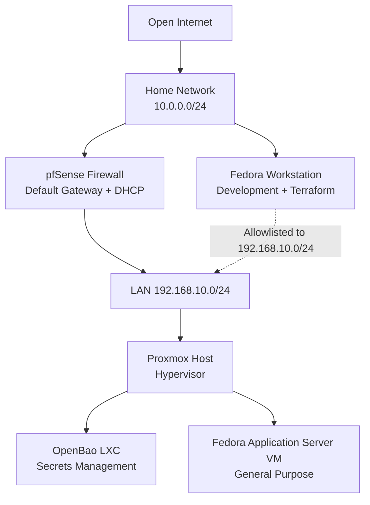
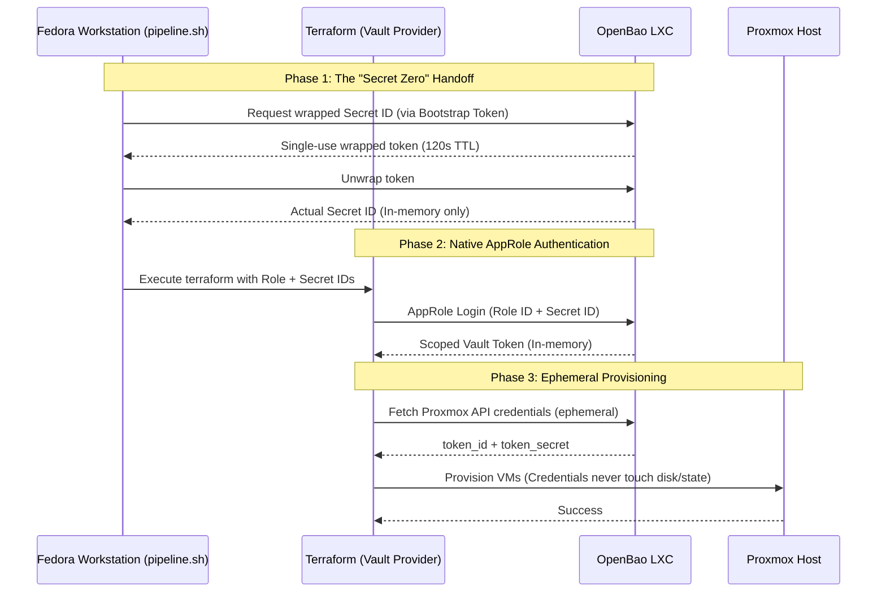

# Homelab Infrastructure as Code

Self-hosted homelab managed as code — Terraform provisions VMs and LXC
containers on Proxmox, with OpenBao handling secrets so credentials never
touch disk or state.

The full writeup of how this came together and why I made these choices is
on my site: [Homelab status check: Terraform, Proxmox, and OpenBao](https://dimitriosskrettas.com/blog/homelab-status-check/).

---

## Architecture

### Network Topology



### IaC OpenBao Auth Workflow



How the flow works:

1. **Secret zero handoff** — a bootstrap token, scoped only to generate
   Secret IDs, requests a response-wrapped Secret ID (single-use, 120s TTL).
   `pipeline.sh` unwraps it in memory and exports it for Terraform.
2. **AppRole authentication** — Terraform logs into OpenBao with the Role ID
   and Secret ID. The AppRole's policy only permits reading
   `proxmox/data/terraform`, so a compromised credential is limited to that
   single secret path.
3. **Ephemeral provisioning** — the Proxmox API token is fetched as an
   ephemeral resource (Terraform >= 1.10), so it is never written to
   `.tfstate`.

---

## Stack

- **Proxmox** — hypervisor, running on repurposed gaming PC hardware.
- **OpenBao** — secrets management, running as an LXC container on Proxmox.
  Chosen over Vault because of the BSL license change.
- **Terraform** — infrastructure provisioning.
    - **bpg/proxmox** provider — more complete than Telmate.
    - **hashicorp/vault** provider — fully compatible with OpenBao.
- **Ansible** — configuration management for what Terraform provisions.
  Currently experimenting; not committed to the repo yet.

---

## Repository Layout

```
.
├── IaC/
│   ├── main.tf           # Providers, OpenBao auth, example VM
│   ├── variables.tf      # Role ID / Secret ID / endpoint inputs
│   └── pipeline.sh       # Wrapped Secret ID bootstrap script
├── LICENSE
└── README.md
```

`.env` lives in `IaC/` and is gitignored — see `.env.example` for the
expected variables.

---

## Prerequisites

- Proxmox host with an API token created for Terraform
- OpenBao server running and unsealed, with the Proxmox token stored at
  `proxmox/data/terraform` (KV v2)
- AppRole auth enabled in OpenBao with a scoped read policy and a separate
  bootstrap token policy
- Terraform >= 1.10 for ephemeral resource support
- `bao` CLI and `jq` on the workstation for `pipeline.sh`

## Usage

```bash
cd IaC
cp ../.env.example .env    # fill in your values
source pipeline.sh         # source, not execute — it exports variables
terraform init
terraform plan
```

---

## Roadmap

- [ ] Consul for service discovery — I want to deploy Consul so that internal services like OpenBao and Proxmox register themselves by name rather than IP, so infrastructure changes don't cascade into broken configs across multiple tools. Consul also integrates natively with OpenBao, meaning I can learn how to use it as a storage backend for OpenBao too.
- [ ] Ansible — commit the configuration management layer I've been experimenting with.
- [ ] CI/CD — I tried Jenkins first, but it felt as though it created more frustrations within my workflow than it added. I'm looking into GitHub Actions or ArgoCD instead, since I eventually want to learn Kubernetes.
- [ ] Cloud integration — I'd like to deploy the Game of Active Directory (GOAD) to a cloud environment as a cloud infrastructure project, provisioned via Terraform to extend this into a hybrid setup.
- [ ] Kubernetes — the end goal is to build a hybrid environment and workflows that I can recreate in Kubernetes. If I like it a lot, I'll migrate this workload from Proxmox to Kubernetes, with ArgoCD for GitOps style deployments.
